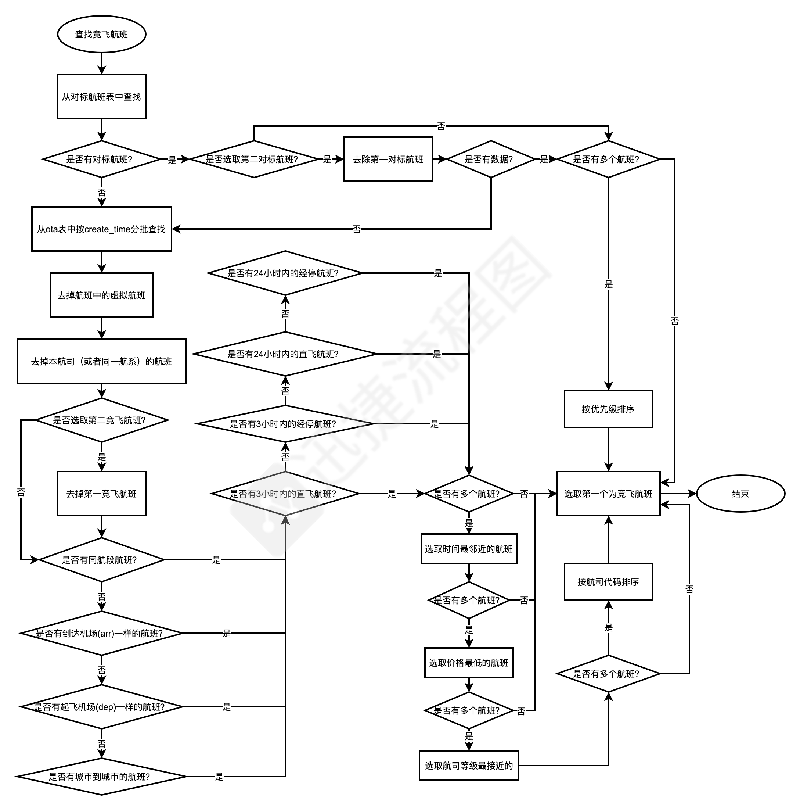
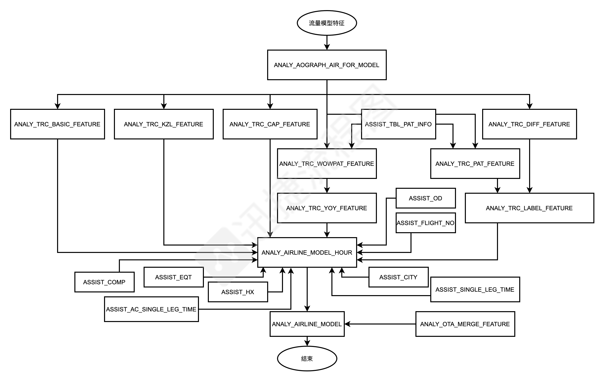
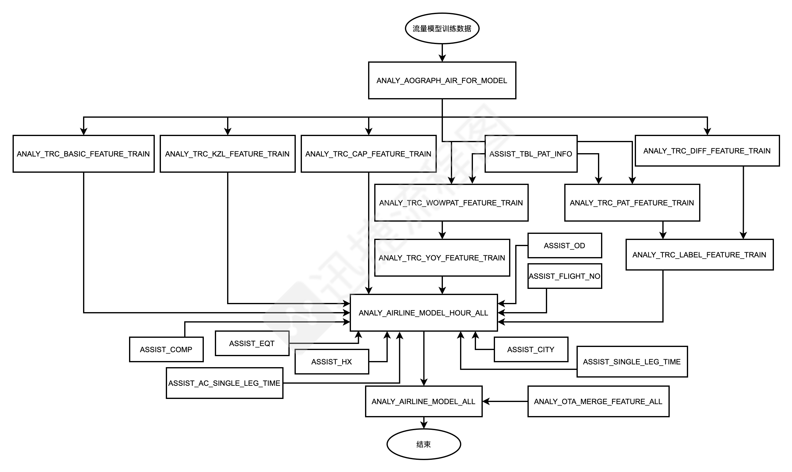
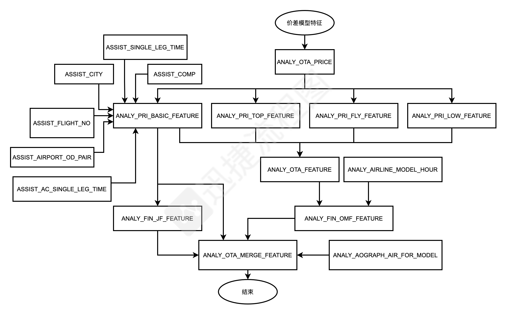
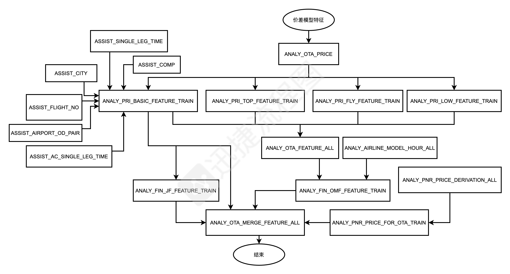

# 工程简介
此项目为东航项目，主要功能是：1.基础数据入库；2.模型特征生成

## 查找竞飞航班逻辑

## 流量模型预测特征流程图

## 流量模型训练数据流程图

## 价格模型预测数据流程图

## 价格模型特征训练数据流程图

## 数据库详情文档
- https://www.kdocs.cn/l/csVGTzpRUfXS

## 数据库表字段，以及特征字段的加工逻辑
- https://www.kdocs.cn/l/cjrhsXKs7aUM

## 配置说明，如有修改，记得重新配置oracle
- 启动前请编辑好application-pro.properties文件中的oracle的信息：
spring.datasource.oracle.url=jdbc:oracle:thin:@${ip}:1521/${service}
spring.datasource.oracle.username=${username}
spring.datasource.oracle.password=${password}
spring.datasource.oracle.database=${database}

## 项目打包流程
- 通过右侧maven打包
- 打好包后，打开idea的Terminal，进入项目的bin文件夹下，执行./pack_tgz.sh $0 $1

###  pack_tgz.sh脚本参数说明
- 第一个参数为打包的环境，TEST、DEV、PRO三种，输入时使用大写首字母，即T、D、P
- 第二个参数为是否部署。1：是；0：否
  - 当第一个参数为T时==>$1 = 0：则只打包，不发送；$1 = 1：自动传送的测试环境，并完成自动部署
  - 当第一个参数不为为T时==>$1 = 0：则只打包，不发送；$1 = 1：自动将部署文件发送给浩男。
  - 第二个参数为D--表示打开发环境的包，即东航测试环境的包
  - 第二个参数为P--表示打生产环境的包，即东航生产环境的包
  
#### 打包实例
./pack_tgz.sh T 1
./pack_tgz.sh D 0
./pack_tgz.sh P 0

### 打包说明
- 当$1都为0时，打的包会移动到桌面，不会删除
- 当$1为1时，打的包会在执行完后自动删除

## 启动说明
- 启动程序：
./service.sh start

- 停止
./service.sh stop

# 延伸阅读
## 利用cktable_to_class.py，从ck的表中获取字段生成文件
- python cktable_to_class.py -t airline_predict.airline_model -c AirlineModel

